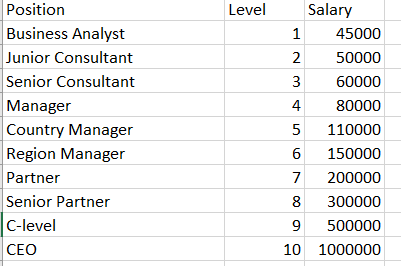
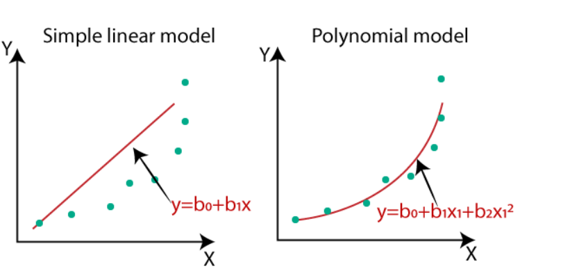
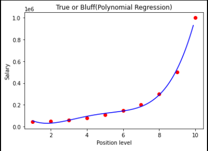
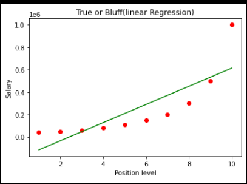

Welcome to the Polynomial-Regression wiki!
# Polynomial-Regression

## Project Status: [Completed]

## Project Intro/Objective
The candidate has told his previous salary 160K per annum, and the HR have to check whether he is telling the truth or bluff. So to identify this, they only have a dataset of his previous company in which the salaries of the top 10 positions are mentioned with their levels. By checking the dataset available, we have found that there is a non-linear relationship between the Position levels and the salaries. Our goal is to build a Bluffing detector regression model, so HR can hire an honest candidate. Below are the steps to build such a model.

Question : "Should we use the linear regression or polynomial to predict the salary" 

## Methods Used
Machine Learning
Python
Polynomial Regression 
Linear Regression
Support Vector Regression

**Raw Dataset **: "Salary.tsv"

## Data processing/transformation and  Model training technique
Polynomial Regression 
Linear Regression
Support Vector Regression

## Detail of the code are the following 

[Source Code](https://github.com/selenalee123/Polynomial-Regression/blob/master/Polynomial%20Regression.ipynb)

## The need of Polynomial Regression in ML

If we apply a linear model on a linear dataset, then it provides us a good result as we have seen in Simple Linear Regression, but if we apply the same model without any modification on a non-linear dataset. Due to the loss function will increase, the error rate will be high, and accuracy will be decreased.
So for such cases, where data points are arranged in a non-linear fashion, we need the Polynomial Regression model. 

Simple visualization of the Polynomial and Simple Linear Regression

 

# ML Polynomial Regression
In the above image, we have taken a dataset which is arranged non-linearly. So if we try to cover it with a linear model, then we can clearly see that it hardly covers any data point. On the other hand, a curve is suitable to cover most of the data points, which is of the Polynomial model.
Hence, if the datasets are arranged in a non-linear fashion, then we should use the Polynomial Regression model instead of Simple Linear Regression.

## The main steps involved in building the moment as follow

Data Pre-processing
Build a Linear Regression model and fit it to the dataset
Build a Polynomial Regression model and fit it to the dataset
Visualize the result for Linear Regression and Polynomial Regression model.
Predicting the output.

## Result

Linear Regression prediction with the salary 330,378.78. 
Polynomial Regression with the salary of 158,862.45. 

## Conclusion
Linear Regression prediction is less precise than Polynomial Regression 

